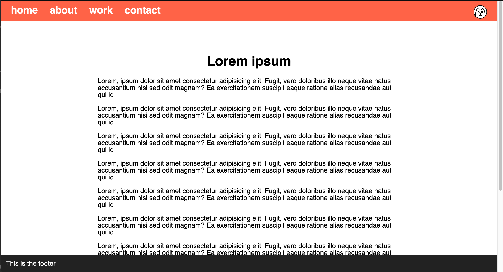

# Navigation und Fußzeile

Erstelle die Webseite, die in den Referenzbildern unten gezeigt wird.

### Anleitung

- Erstelle eine neue Datei namens `index.html` im Projektverzeichnis
- Erstelle eine neue Datei namens `style.css` im Projektverzeichnis
- Die Seite sollte so viel Inhalt haben, dass eine vertikale Bildlaufleiste angezeigt wird.
- Füge oben eine Navigationsleiste hinzu, die die Farbe "#f35136" haben sollte.
- Platziere das Katzensymbol auf der rechten Seite der Navigationsleiste
- Füge unten eine Fußzeile (footer) ein, die Farbe sollte "#222" sein.
- Sowohl die Navigationsleiste als auch die Fußzeile müssen immer sichtbar sein.
